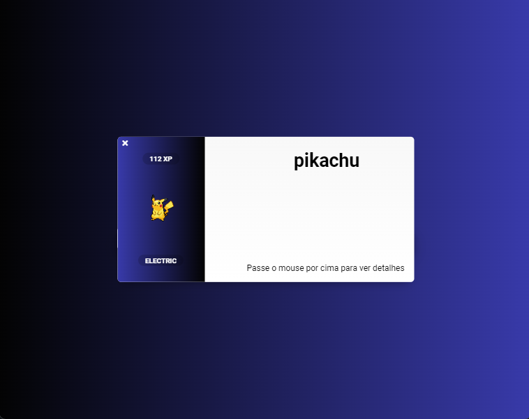
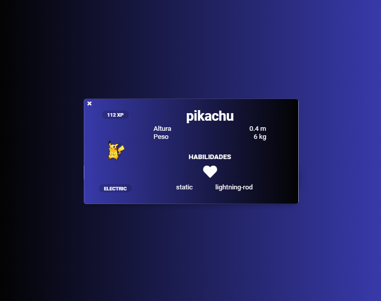
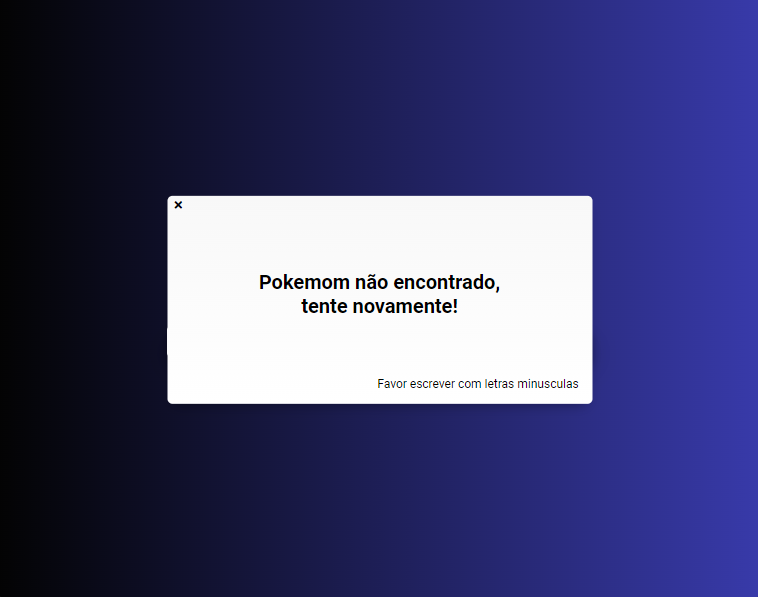

<h1 align="center">PokeAPI 👾</h1>

<p align="left">🔥 PokeAPI is a project that allows you to search for information about pokemons!

<br />

Through an input field it is possible to obtain details such as size, weight, XP, type and abilities of a certain pokémon. In addition, it has responsiveness to provide a pleasant experience on mobile devices.
</p>

<br />

## 💻 Version 2.0

<br />

<div id="layout" align="center">
  <p align="stretch">
    
    
    
    
  </p>
</div>

<br />

Try it yourself!!🔎 https://poke-api-steel.vercel.app/

<br />

## 🎡 Functionalities

- Pokémon Search: The project allows you to search for information about a specific Pokémon through the input field.

- Pokémon details: After the search, details about the Pokémon are displayed, such as size, weight, XP, type and skills.

- Error Handling: If an error occurs during the search, an error card is displayed to inform the user about the failure.


<br />

## 🔧 Resources used

This project was developed with the following resources and technologies:

- [Vue](https://vuejs.org/)
- [JavaScript](https://developer.mozilla.org/pt-BR/docs/Web/JavaScript)
- [Node e NPM](https://nodejs.org/)
- [SASS](https://sass-lang.com/)
- [Vite](https://vitejs.dev/)
- [API PokéAPI](https://pokeapi.co/)

<br />

## 🚀 How to run the project

1. Clone the repository to your local machine.

```bash
$ git clone https://github.com/maarcusvinicius/PokeAPI.git
```

2. Navigate to the project directory and install dependencies.

```bash
$ cd PokeAPI
$ npm install
```
3. Start the development server.

```bash
$ npm run
```

4. Open your browser and go to http://localhost:5173 to view the application.

<br />

## 💻 Project structure

```bash
PokeAPI/
  .vscode/
  public/
  src/
    assets/
    components/
      Buscar.vue
      Card.vue
      Pokemon.vue
    App.vue
    main.js
  .gitignore
  README.md
  index.html
  package-lock.json
  package.json
  vite.config.js
```

<br />

## 🏍️ Components

<br />

- `Buscar.vue`: responsible for the search bar where users can type the name of the desired Pokémon. It captures the typed value and sends the request to the API to get the details of the corresponding Pokémon.

- `Card.vue`: used to display Pokémon information. It takes Pokémon data as properties and displays it in a structured and stylized way. The Card can display details such as the Pokémon's name, type, abilities, size, weight, and XP.

- `Pokemon.vue`: responsible for displaying the Pokémon details screen. It takes the Pokémon's details as properties and renders the Card component to show the information.

- `App.vue`: responsible for containing and managing all other components of the project. It defines the general layout of the application, such as header, footer and other elements common to all pages.


<br />
<br />
<h4 align="center"> 
	🚧  PokeAPI 👾 FINISHED  🚧
</h4>
<br />
<br />
<br />
<br />
<br />

Made with ❤️ by Marcus Vinicius 👋🏽 Get in touch!

//done readme marcus


### 𝐇𝐞𝐥𝐥𝐨 𝐭𝐡𝐞𝐫𝐞, 𝐟𝐞𝐥𝐥𝐨𝐰 <𝚌𝚘𝚍𝚎𝚛𝚜/>! 

I'm a Web Developer, a programmer looking to make <br /> a difference in the digital world. [**Personal Site**](https://marcus-dev.vercel.app/) 🚀

#### My current tools

📲 Front-end Mobile with React Native  
💻 Front-end Web with Reactjs  
📡 Back-end with Nodejs  
🔣 Typescript  
🧰 And more...

#### 💬 Find me elsewhere

[](https://www.linkedin.com/in/marcus-vinicius-507718228/)
[](marcus.editor77@gmail.com)
